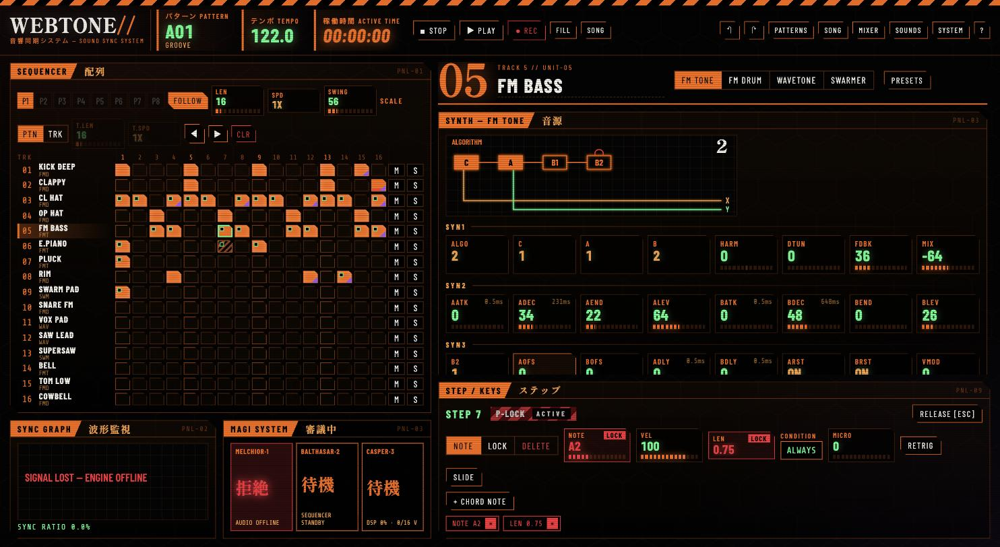
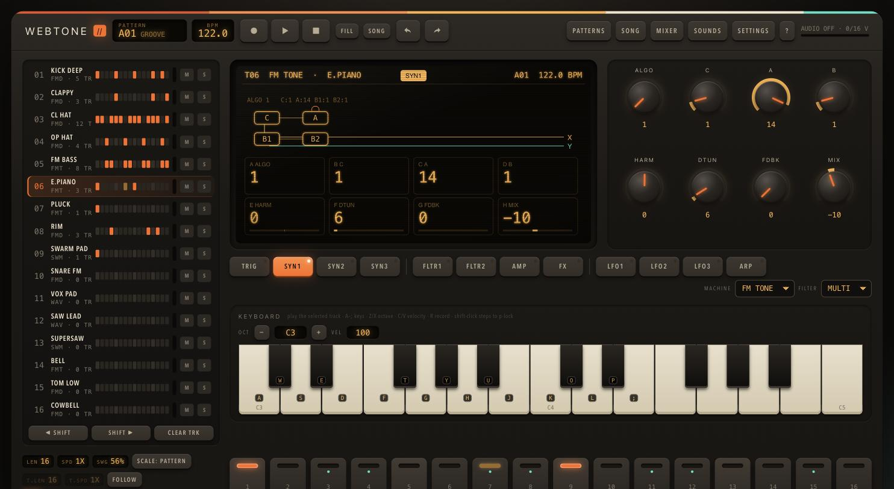

# DEVLOG

Running log of development sessions on WEBTONE//.

---

## 2026-09-27 — Session 1: initial build

**What we built:** WEBTONE// is a zero-dependency browser groovebox modelled on the Elektron Digitone II.
- **Engine:** 16 tracks and 16 voices, with the FM TONE, FM DRUM, WAVETONE and SWARMER machines, plus filters, LFOs, arpeggiator and send FX. It runs in a single AudioWorklet with a sample-accurate sequencer.
- **Sequencer:** parameter locks, trig conditions, micro timing, retrigs, chords, song mode.
- **UI:** a retrofuture panel.
- **Agent tooling:** the `window.dt` API, a headless Node engine, tests, and render, bench and docs tools.

**Wall time:** about 1 h 21 min. That runs from when the project directory was created (15:41) to the final commit (17:02). This is inferred from timestamps, not tracked directly.

**Usage** (from `/usage`, Claude Max $200 plan):
- about 3% of the current session limit
- about 1% of the current weekly limit

**Token detail** (from the model's visible token budget counter): about **365k tokens** used during the session. The counter went from 15,000,000 to about 14,634,500 remaining. It covers context and output as the harness counts them. It is not a billing-exact figure, and cached versus uncached input isn't broken out.

**Output:**
- 2 commits (`b3012b9`, `86e5b50`)
- about 7.6k lines across 36 tracked files
- 40 Node tests, all passing
- `dt.selftest()` passing in Chrome

**Verification:**
- Chrome: engine boot, playback, p-locks through the UI, all overlays, offline WAV render and the self-test.
- Node: benchmarks show about 5–7% of one core at full 16-voice load.

**Known gaps / next ideas:**
- MIDI tracks and external audio input are not implemented.
- FM algorithms and parameter scaling are approximations of the hardware.
- Factory sounds were balanced by measurement only, not by ear.

---

## 2026-09-28 — Session 2: swappable UIs, MAGI, public repo, live deploy

*MAGI, the new default UI, on the live site. The FM bass track is selected and a p-locked step is open in the inspector (NOTE/LEN show LOCK). The capture ran in a background automation tab where audio can't start, so the MAGI tiles and scope read "engine offline".*

*CLASSIC, the original hardware-style panel, still one keypress (`\`) away.*

**What we did:**
1. **Open source:** added the MIT license and published https://github.com/artgillespie/webtone.
2. **Decoupled UI:** a headless **host** (`src/app/host.js`: store, engine, actions, keys, MIDI, `dt` API, render loop) plus swappable **UI plugins** (`src/uis/*`, contract in `src/uis/README.md`). Switch in settings, with `\`, `?ui=`, or `dt.useUI()`.
3. **MAGI UI** (new default), a direct-manipulation command center styled after 90s anime displays:
   - every parameter of the track visible at once as draggable readouts;
   - editable graphs: envelopes, filter curve with base-width band, LFO shapes, FM algorithm;
   - a paintable 16×16 matrix, MAGI status tiles, and windows for mixer, patterns, song, sounds and system.
4. **Store:** one drag = one undo step, via `beginGesture`/`endGesture`.
5. **Deploy:** Cloudflare Workers static assets (`wrangler.jsonc`, `_headers` for COOP/COEP, `.assetsignore`).
   - Live at **https://webtone.artgillespie.workers.dev**.
   - Auto-deploys every push to `main` through Workers Builds, with `npm test` as the build gate; changes go live in about 60–80 s.
   - Cloudflare's agent plugin (skills + MCP) is installed in Claude Code.
6. **Build info:** `tools/version.mjs` stamps `version.json` (short SHA, date) on every deploy. Settings shows it with the GitHub link, and `dt.about()` returns it.

**Wall time:** about **1 h 10 min** (10:45 → 11:56 by commit timestamps), including the time spent on Cloudflare signup and email verification. The UI framework + MAGI part took about 35 min of that.

**Usage:**
- From `/usage`: not yet recorded (add here).
- **Tokens:** about **200k** for the session, summed from the model's per-turn token budget counter. That's about 150k for the UI plugin framework + MAGI and about 50k for GitHub, Cloudflare setup, deploys and polish. It isn't billing-exact.

**Verification:**
- 44 Node tests, including new store undo/gesture tests.
- `dt.selftest()` passes under both UIs.
- A real mouse drag on the MAGI filter graph gives one undo step.
- Live site:
  - COOP/COEP headers are served and the page is `crossOriginIsolated`.
  - Dev files return 404.
  - The offline render matches local exactly (RMS −16.4 dB).
  - `version.json` reports the pushed SHA, built by `workers-builds`.
- Not verified by automation: realtime audio on the live site, because a background tab gives no user gesture. Checked by hand.

**Known gaps / next ideas:**
- MAGI assumes a desktop viewport and stacks below 1280 px.
- The CLASSIC knob drag still uses time-based undo coalescing.
- A custom domain is optional.
